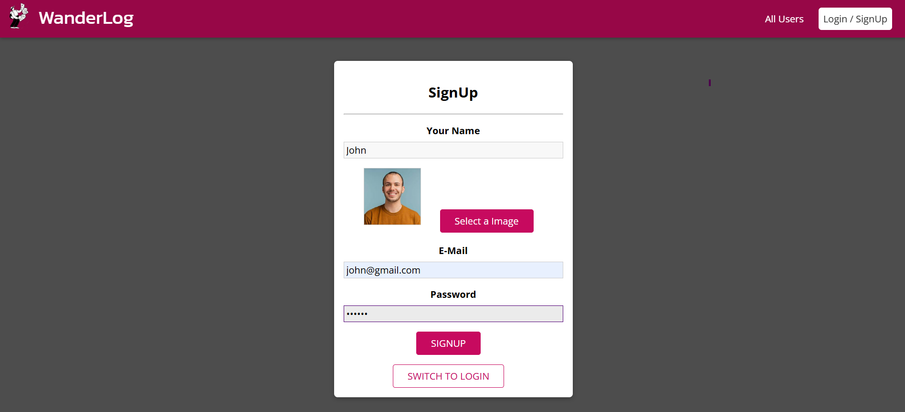
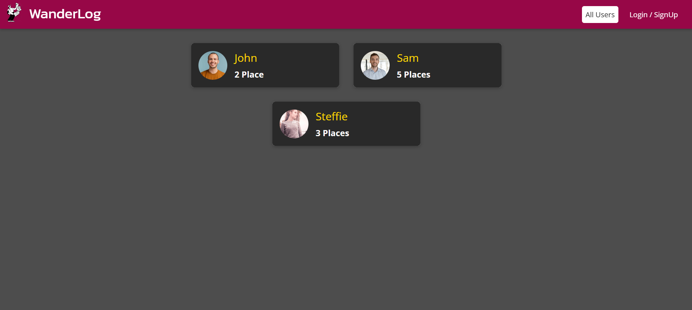
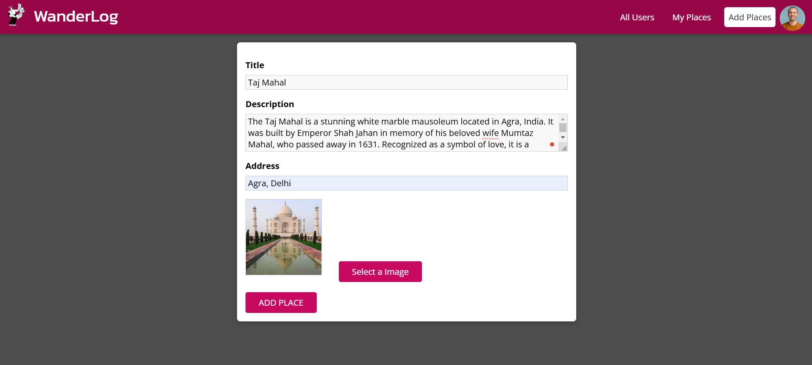
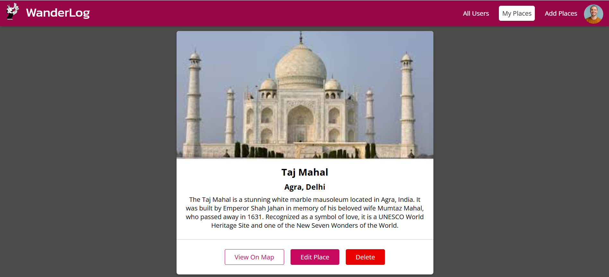

# WanderLog - Travel Diary and Location Sharing Platform

WanderLog is a web application built using the MERN stack (MongoDB, Express.js, React.js, Node.js) that allows users to document and share the places they’ve visited. Users can add details about each place, view locations on a map, and explore places shared by others.

## Features

- **User Authentication**: Users can sign up, log in, and manage their accounts.
- **Add Places**: Users can add places they’ve visited with the title, description, address, and images.
- **Map Integration**: View the added places on a map using the "View on Map" feature.
- **Edit and Delete Places**: Users can edit or delete places they’ve previously added.
- **Explore Other Users' Places**: Users can see the places added by other users.

## Tech Stack

- **Frontend**: React.js
- **Backend**: Node.js, Express.js
- **Database**: MongoDB
- **Authentication**: JWT (JSON Web Tokens)
- **Geolocation**: Google Maps API (or other map service)
- **File Upload**: Multer (for handling image uploads)
- **File Storage**: Firebase

## Screenshots

### SignUp



### Users



### Add Place



### Places



### Map


## Live Site

Check out the live version of the app here:  
[Live Site Link](https://wanderlog-travel-diary.netlify.app)

## GitHub Repository

You can find the source code of the project here:  
[GitHub Repository Link](https://github.com/SathishKumar-2004/Travel-Diary-App.git)

## Installation

### Prerequisites

Ensure you have the following installed on your local machine:

- Node.js
- MongoDB (locally or a cloud database like MongoDB Atlas)

### Clone the Repository

```bash
git clone https://github.com/SathishKumar-2004/Travel-Diary-App.git
```
